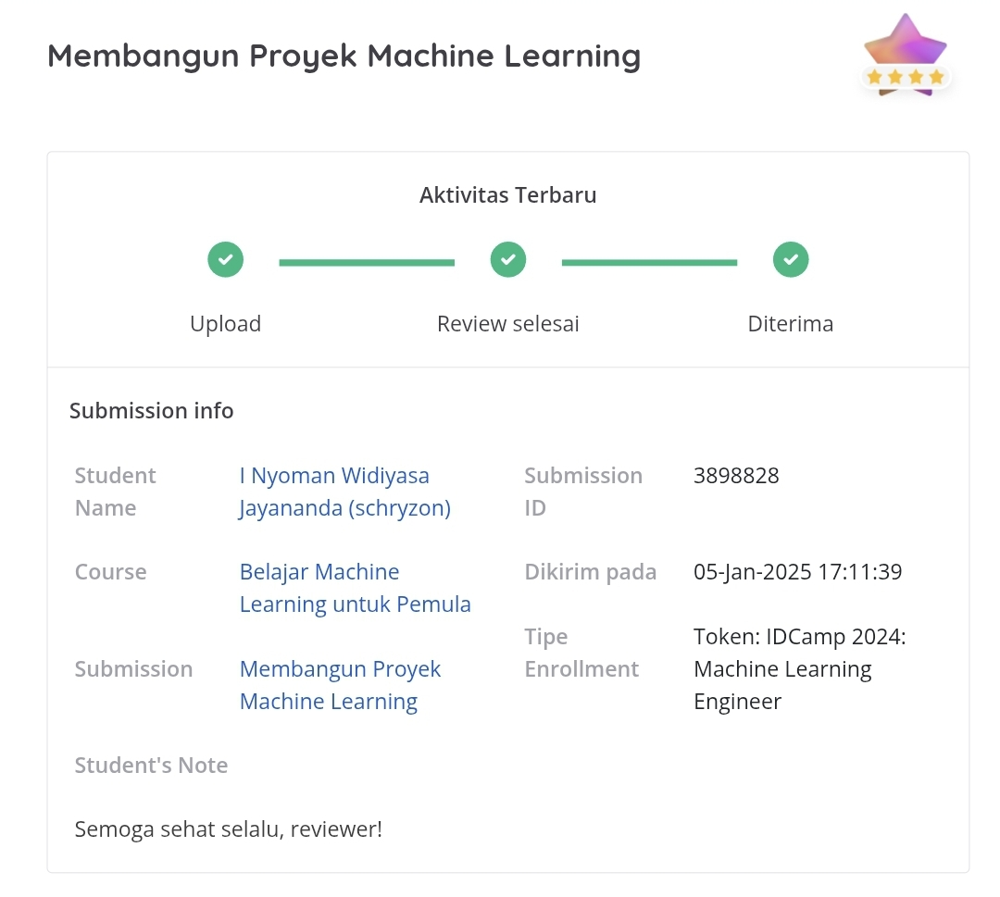

# Proyek Akhir Belajar Machine Learning untuk Pemula - Dicoding

## Deskripsi Proyek

Proyek ini merupakan bagian dari tugas akhir kelas Machine Learning Pemula di Dicoding. Proyek ini bertujuan untuk melakukan analisis dan pemodelan machine learning menggunakan dataset pesawat terbang dari Kaggle: [New and Used Aircraft Pricing Data oleh artemkorottchenko](https://www.kaggle.com/datasets/artemkorottchenko/used-aircraft-pricing/data) yang telah dimodifikasi (terima kasih!). Proyek ini terdiri dari dua bagian utama: clustering dan klasifikasi.

## Struktur Proyek

1. **Clustering**
    - Notebook: `[Clustering]_Submission_Akhir_BMLP_I_Nyoman_Widiyasa_Jayananda.ipynb`
    - Deskripsi: Pada bagian ini, dilakukan analisis eksplorasi data (EDA) dan clustering menggunakan algoritma K-Means dan DBSCAN untuk mengelompokkan data pesawat berdasarkan harga dan kategori.
    - Hasil Silhouette Score: 0.81 (K-Means) dan 0.79 (DBSCAN)

2. **Klasifikasi**
    - Notebook: `[Klasifikasi]_Submission_Akhir_BMLP_I_Nyoman_Widiyasa_Jayananda.ipynb`
    - Deskripsi: Pada bagian ini, dilakukan pemodelan klasifikasi menggunakan algoritma Random Forest untuk memprediksi cluster dari data pesawat yang telah dikelompokkan pada tahap clustering.
    - Hasil Accuracy: 99.2%

## Persyaratan

- Python 3.12 atau lebih tinggi
- Jupyter Notebook
- Menginstall seluruh dependency dari `requirements.txt`
> `pip install -r requirements.txt`

## Cara Menjalankan

1. Pastikan Anda memiliki Python 3.12 atau lebih tinggi dan Jupyter Notebook terinstal di sistem Anda.
2. Buka Jupyter Notebook.
3. Jalankan notebook `[Clustering]_Submission_Akhir_BMLP_I_Nyoman_Widiyasa_Jayananda.ipynb` untuk melakukan clustering.
4. Jalankan notebook `[Klasifikasi]_Submission_Akhir_BMLP_I_Nyoman_Widiyasa_Jayananda.ipynb` untuk melakukan klasifikasi.

## Hasil Review

Memperoleh bintang 4, tanpa melakukan tahapan-tahapan opsional seperti:
1. Feature Selection
2. Search Algorithm

*Guess that's in my to-do list now!*

  

## Lisensi

Proyek ini dilisensikan di bawah [Lisensi MIT](https://opensource.org/licenses/MIT).
Anda diperkenankan untuk menggunakan, menyalin, mengubah, dan mendistribusikan proyek ini dengan syarat menyertakan pemberitahuan hak cipta asli dan pemberitahuan lisensi ini dalam semua salinan atau bagian substansial dari perangkat lunak.
